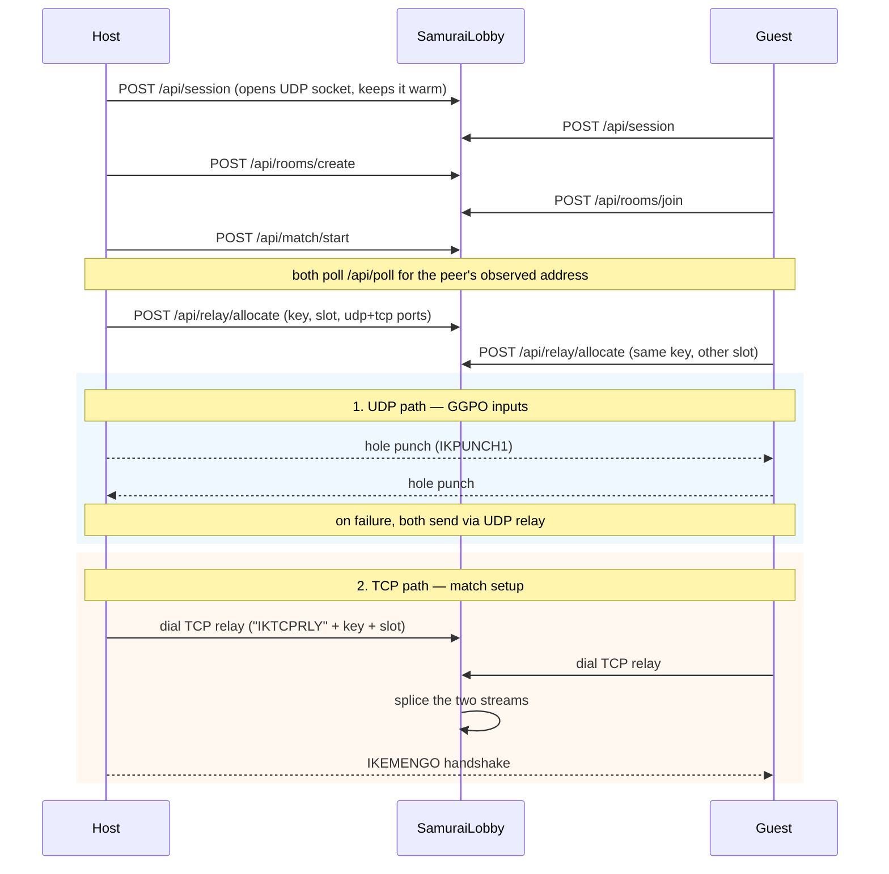

# Samurai Shodown II — Online

*English · [Tiếng Việt](ARCHITECTURE.vi.md)*

Play Samurai Shodown II over the internet with rollback netcode, matchmaking,
and NAT traversal, without either player forwarding a port.

The original plan was to rewrite the game in Unity; that route and what it
would take to resume it are described in [`README.md`](README.md#b-rewrite-in-unity--the-original-plan-still-viable).
It was abandoned because reimplementing a 1994 fighting game's physics,
hitboxes, and frame data from scratch is a multi-year effort, and rollback
netcode is far harder to retrofit than to inherit. Forking a mature
MUGEN-compatible engine that already has GGPO integration gets to a playable
online game far sooner.

---

## 1. Layout

This is a **multi-module** repository, not a monorepo with one build. Each Go
module is independent and versioned separately.

The repository root is `SamuraiOnline/`. Everything SNK owns lives one level
**above** it and is therefore outside the repo by construction, not merely by
`.gitignore`:

```
Samurai/                      workspace root, not tracked
├── Game/                     original game data
├── Decompiled code/          Ghidra output of SAMURAI2.EXE
├── Samurai.rep/              Ghidra project
├── Screenpack/               third-party MUGEN art
├── SamuraiAssets/            sprites extracted by sprtool
├── SamuraiShodown-XMatStudio/  student project, source for chargen
└── SamuraiOnline/            <- git repository root
```

| Path | Module | What it is |
|---|---|---|
| `Ikemen-GO/` | `github.com/ikemen-engine/Ikemen-GO` | Fork of the engine. Runs the game. |
| `ggpo/` | `github.com/ikemen-engine/ggpo` | Fork of the rollback library. |
| `SamuraiLobby/` | `samurai/lobby` | Matchmaking + NAT traversal server. |
| `SamuraiTools/chargen/` | `samurai/chargen` | Builds Ikemen characters from C++ animation tables. |
| `SamuraiTools/sprtool/` | `samurai/sprtool` | Reverse-engineers and extracts the original game's sprites. |
| `deploy/` | — | systemd unit and defaults for running the lobby as a service. |
| `unity-prototype/` | — | Abandoned Unity attempt. Kept for reference only. |

Both forks are **vendored**, not submodules: their upstream checkouts had
detached heads and uncommitted work, so the files are committed directly here.
Upstream commits, for rebasing later:

| Fork | Upstream | Commit |
|---|---|---|
| `ggpo/` | `github.com/ikemen-engine/ggpo` | `b08e7d27b7f20d7bb5bf5e20beb655060e82769a` |
| `Ikemen-GO/` | `github.com/ikemen-engine/Ikemen-GO` | branch `develop` |

### Why two forks

`ggpo` had to be forked because `transport.Connection` references
`ggpo/internal/messages`, and Go forbids importing another module's `internal`
package. Implementing the interface from outside is impossible — this was
verified empirically, not assumed. The fork carries two changes:

```go
// ggpo/transport/udp.go
func NewUdpWithConn(h MessageHandler, conn net.PacketConn, localPort int) Udp
```

That lets the game hand GGPO a socket that has already been through NAT
traversal, instead of GGPO binding its own.

```go
// ggpo/internal/polling/poll.go
const MaxLoopSinks = 4 + 32 + 1
```

The loop-sink buffer was 16 while `MaxSpectators` claimed 32, so the host
panicked once the fifteenth watcher joined. A test found it; the constant now
covers every endpoint that can register a loop.

`Ikemen-GO/go.mod` wires it up:

```
replace github.com/ikemen-engine/ggpo => ../ggpo
```

---

## 2. How a match is established



Two independent paths, because they have different requirements:

- **UDP** carries GGPO inputs. Latency-critical, so direct is strongly
  preferred and the relay is a last resort.
- **TCP** carries match setup (and, if rollback is disabled, *all* inputs).
  A direct link needs the host to accept inbound connections, which is exactly
  what a player behind NAT cannot do, so the lobby path always uses the relay.

### The socket-reuse constraint

A NAT maps each **source port** separately. Probing from a throwaway socket
reveals a mapping the game will never use. So the UDP socket is opened when the
player enters the lobby, kept warm with periodic discovery packets, and only
handed to GGPO once a path is chosen. This is why `NewUdpWithConn` exists.

---

## 3. Wire protocols

### UDP relay (`SamuraiLobby/relay.go`)

| Byte 0 | Payload | Direction |
|---|---|---|
| `0x01` | padding, min 64 bytes | client → server, address request |
| `0x81` | `[len][ip][port BE16]` | server → client, observed address |
| `0x02` | `[16-byte key][slot][data]` | client → server, relay data |
| — | `data` only | server → peer, header stripped |

The 64-byte minimum on address requests stops the server being used as a
traffic amplifier for spoofed sources: the reply must never be larger than the
request.

Because the relay strips its header before forwarding, the peer receives
untouched payloads and GGPO can treat the relay address as if it were the
opponent.

### TCP relay (`SamuraiLobby/tcprelay.go`)

Fixed 25-byte header, then the stream is spliced verbatim:

```
"IKTCPRLY" [16-byte key] [slot]
```

The key is the one already issued by `/api/relay/allocate`, so no new
credential is introduced. Unknown keys are rejected — otherwise two strangers
who agree on a random key could use the server as a free proxy.

### HTTP API (`SamuraiLobby/api.go`)

```
POST /api/session          -> id, token, udpToken, relayHost, relayPort
GET  /api/rooms            -> rooms[]
POST /api/rooms/create     -> room
POST /api/rooms/join       {roomId, spectator}
POST /api/rooms/leave
POST /api/match/start
POST /api/match/manifest   {manifest}  (host only)
POST /api/poll             -> self, room, match
POST /api/relay/allocate   -> host, port, tcpPort, key, slot
GET  /healthz
```

Spectators take a seat that is separate from the two player slots, so a room
stays joinable while people watch. Only the host is told where the watchers
are, because only the host streams frames to them, and only the host may
publish the manifest that tells watchers which fight to load. The relay has
two slots, so watchers are refused one: they follow the punched UDP path or
not at all.

Security decisions worth keeping:

- The client IP always comes from `RemoteAddr`, never from the request body.
  `X-Forwarded-For` is honoured only under `-trust-proxy`.
- `udpToken` is separate from the HTTP bearer token, so the token that travels
  in cleartext UDP cannot be replayed against the HTTP API.
- Tokens come from `crypto/rand`.
- Relay sessions are capped: 64 MiB, 60 s idle, 2 h lifetime.

---

## 4. Engine fork — files added or changed

| File | Status | Purpose |
|---|---|---|
| `src/lobby.go` | new | Lobby client. All HTTP runs off the game loop. |
| `src/netpath/transport.go` | new | NAT session, hole punching, UDP `relayConn`, `DialRelayStream`. Its own package so it builds without cgo. |
| `src/netpath/handshake.go` | new | The token both peers exchange before a setup stream is trusted. |
| `src/nettransport.go` | new | Aliases `netpath` into `package main`, so engine call sites stay unchanged. |
| `cmd/netcheck/main.go` | new | Standalone, cgo-free checker for the network path between two machines. |
| `src/netplay.go` | changed | `conn` is now `net.Conn`; added `AcceptRelayed`/`ConnectRelayed` and the direct-first `AcceptDirectThenRelay`/`ConnectDirectThenRelay`. |
| `src/rollback.go` | changed | `InitP1`/`InitP2` call `natRemote` and `initGGPOConnection`; added `InitSpectator` and `attachSpectators`. |
| `src/script.go` | changed | `enterNetPlay` uses shared `netPlayBegin()`. |
| `src/config.go` | changed | `Netplay.LobbyURL`, `Netplay.LobbyName`. |
| `src/system.go` | changed | calls `lobbyScriptInit(l)`. |
| `external/script/lobby.lua` | new | Lobby browser screen, spectator entry, manifest publishing. |
| `external/script/main.lua` | changed | `lobbybrowser` handler; `f_connect` takes a relay role. |
| `data/ikemen1/system.def` | changed | `ONLINE LOBBY` menu entry. |
| `data/select.def` | changed | Ikemen's sample characters removed from the roster. |

### Lua bindings (`src/lobby.go`)

```
lobbyConnect  lobbyDisconnect  lobbyStatus   lobbyRooms
lobbyCreateRoom  lobbyJoinRoom  lobbyLeaveRoom
lobbyMatch    lobbyMarkPlaying  lobbyEstablishPath
lobbyNatMode  lobbyLocalAddr    lobbyRelayStream  lobbyEnterNetPlay
lobbySpectateRoom  lobbyPublishManifest  lobbyManifest  lobbyEnterSpectate
```

---

## 5. Asset pipeline

### `sprtool` — original game sprites

The `.SPR` format was reverse-engineered from the decompiled blitter, not
guessed. Full spec is in `/memories/repo/samsho2-formats.md`.

```
Container (magic 0x1053):
  0x00 u16 magic   0x02 u16 count   0x04 u32 dataSize   0x08 n*12 records
Record (12 bytes):
  u16 type(0=sprite,1=empty)  u16 palette bank  u16 w  u16 h  u32 offset
Pixels (from FUN_004dc8e0):
  per row: [u16 rowByteLength incl. prefix][control bytes]
  b & 0x80  -> literal run of (b & 0x7F) indices
  else      -> skip b transparent pixels
Palette:
  4bpp; bank is an index into a 4096-entry RGB555 table
  table found at GAME1.PRG + 0x14000 (6 snapshots of 4096 entries)
```

Result: 12,472 sprites from 17 character files, 0 failures.

### `chargen` — playable characters

Converts the X-Mat Studio C++ animation tables into an Ikemen character
(`.def`, `.sff`, `.air`, `.cns`, `.cmd`).

Two things that are easy to get wrong and are pinned by tests:

- The `.def` **must** list `st = <base>.cns`. Ikemen's `Compile()` reads only
  `cmd`, `stcommon`, and keys matching `^st[0-9]*$` — never `cns`. Without it
  every state is silently ignored and the character has no moves.
- A character must **not** define states 0/10/11/12/20/40/50/52. Ikemen ships
  correct versions in `data/common1.cns.zss`, and the engine drives the
  transitions between them (`char.go`, "Perform basic actions") — but only
  while `ctrl` is set. Redefining them broke walking and standing up.

Those common states also name animations by hard-coded number, and a character
missing one enters a state with no art — if the state also waits on `animTime`,
it never leaves. This bit twice, first walking then guarding, and both times it
was found by playing rather than by testing. `commonanims_test.go` now reads
the numbers straight out of `common1.cns.zss` instead of repeating them, so a
new reference fails the build rather than the match. `chargen` fills the gaps
by aliasing missing numbers onto the closest existing frames; transitions the
engine waits on get an explicitly finite duration.

---

## 6. Controls

Four-button Neo Geo layout, matching the arcade original.

| Function | Neo Geo | P1 | P2 |
|---|---|---|---|
| Move | — | W A S D | arrows |
| Quick slash | A | J | KP_1 |
| Power slash | B | K | KP_2 |
| Strong slash | A+B | L | KP_3 |
| Quick kick | C | U | KP_4 |
| Power kick | D | I | KP_5 |
| Strong kick | C+D | O | KP_6 |
| Pick up sword | — | P | KP_7 |
| Start | — | Space | KP_0 |

Buttons map to `x y z a b c` in MUGEN order — punches on `x y z`, kicks on
`a b c`. Getting this backwards is an easy mistake; `keyconfig_test.go` guards
it. Note that `StringToKeyLUT` is only populated by `initLUTs()`, so any test
touching key names must call it first.

---

## 7. Build and run

Building needs Linux; on Windows either take the release build or build inside
WSL or MSYS2. Paths are relative to the repository root. `$GAME` is wherever you
keep your own copy of the game data, and `$XMAT` the X-Mat Studio checkout —
neither belongs in this repository.

```bash
# Engine. These flags are mandatory.
cd Ikemen-GO
GOFLAGS=-mod=mod GOEXPERIMENT=arenas CGO_ENABLED=1 go build -o Ikemen_GO_Linux ./src

# Run under WSLg
DISPLAY=:0 WAYLAND_DISPLAY=wayland-0 XDG_RUNTIME_DIR=/mnt/wslg/runtime-dir \
  ./Ikemen_GO_Linux -p1 jubei -p2 jubei2 -s kfm

# Lobby server
cd SamuraiLobby
go run . -addr :8080 -relay-addr :8081 -relay-tcp-addr :8081 -relay-host <public-ip>

# Regenerate characters
cd SamuraiTools/chargen
go run . -src "$XMAT/ModulePlayer.cpp"  -sheet "$XMAT/Game/Assets/Sprites/jubei.png" \
  -out ../../Ikemen-GO/chars/jubei  -name Jubei      -base jubei
go run . -src "$XMAT/ModulePlayer2.cpp" -sheet "$XMAT/Game/Assets/Sprites/Jubei2.png" \
  -out ../../Ikemen-GO/chars/jubei2 -name "Jubei 2P" -base jubei2

# Extract original sprites
cd SamuraiTools/sprtool
go run . -f "$GAME/DATA/F0C01.SPR" -x ./out/F0C01 \
  -pal "$GAME/DATA/GAME1.PRG" -palbase 81920
```

Build dependencies: `golang-go git pkg-config make nasm yasm build-essential
libxmp-dev libsdl2-dev libgtk-3-dev libavformat-dev libavcodec-dev libavutil-dev
libswresample-dev libswscale-dev libavfilter-dev`

### Tests

```bash
(cd SamuraiLobby         && go test ./...)
(cd SamuraiTools/sprtool && go build ./...)
(cd SamuraiTools/chargen && CHARGEN_SOURCE="$XMAT/ModulePlayer.cpp" go test ./...)
(cd Ikemen-GO && GOFLAGS=-mod=mod GOEXPERIMENT=arenas CGO_ENABLED=1 \
  go test ./src/... -count=1 -vet=off)
```

### Checking the network path between two machines

The engine links SDL, FFmpeg and GTK, so its test binary needs some 200 shared
libraries and cannot simply be copied onto another machine. `cmd/netcheck`
imports only `src/netpath`, which is why that package exists: it is pure Go, so
the checker cross-compiles to one static file that runs anywhere.

```bash
cd Ikemen-GO
CGO_ENABLED=0 go build -o netcheck ./cmd/netcheck
CGO_ENABLED=0 GOOS=windows GOARCH=amd64 go build -o netcheck.exe ./cmd/netcheck
```

Run it on both machines against the same lobby and room:

```bash
./netcheck -lobby http://<lobby-host>:8080 -role host  -room check
./netcheck -lobby http://<lobby-host>:8080 -role guest -room check
```

It reports `PUNCHED` or `RELAYED`, and confirms the match-setup stream carries
bytes intact. This exercises the same code the engine uses, so a failure here
is a real failure.

There is also a live check that drives the engine's own `LobbyClient`, skipped
unless a server is named:

```bash
SAMURAI_LIVE_LOBBY=http://<lobby-host>:8080 SAMURAI_LIVE_ROLE=host \
  go test ./src -run TestLiveLobby -v -count=1 -vet=off
```

---

## 8. Status

### Working

- Lobby server: sessions, rooms, matchmaking, polling — 25 tests
- UDP hole punching with relay fallback. Verified between two machines with one
  layer of NAT between them: punched in ~200-350 ms, setup stream intact
- TCP relay for match setup, direct-first with a relay fallback
- Engine builds and runs; lobby browser reachable from the main menu
- `chargen`: Jubei + Jubei 2P, 100+ animations, 18 attacks, 3 specials — tested
- `sprtool`: `.SPR` fully decoded, 12,472 sprites extracted with true colour
- SamSho mechanics: POW gauge on damage, rage at POW ≥ 2500, disarm and rearm
- Spectator mode, via `ggpo.NewSpectator`
- CI on every push (`ci.yml`), Linux and Windows builds on tags (`release.yml`)
- `cmd/netcheck`: runs the real NAT and relay code as a standalone, cgo-free
  binary, so the network path can be checked from any machine

### Not working / not done

| Gap | Notes |
|---|---|
| **Never tested across the internet** | Punching works between two machines through one NAT, but every test so far has been on one LAN. A symmetric NAT or CGNAT, which is what most home connections now give out, is a much harder case and is still unproven. |
| **The game itself has never been played over the network** | `netcheck` proves the path opens. It says nothing about character select syncing, rollback behaviour or desync. |
| **Only one real character** | Jubei, from Samurai Shodown **1**. Not a SamSho II roster. |
| **Extracted sprites are unusable as characters** | The `.SPR` record has no pivot, no animation grouping, no frame duration, no hitboxes. Building characters from them means reverse-engineering the animation system too. |
| **Palettes are per-character at runtime** | The pointer table at VA `0x77EC00` is zero in the EXE and filled at run time, so only Haohmaru's colours are known statically. Needs a live palette-RAM dump. |
| **Gameplay untuned** | Velocities are KFM defaults. Scale, timing, and hit properties are unverified against the original. |
| **Spectators do not verify content** | Players compare a content fingerprint before a match; watchers do not. A watcher whose `select.def` differs from the host's will load the wrong fighters, because the manifest carries roster indices. |

---

## 9. Legal

SNK owns Samurai Shodown II and still sells it. This repository must ship the
**engine and tools only**. Game data, extracted sprites, extracted audio, and
the decompiled binary must never be committed or distributed — this is the
ScummVM / OpenRA model: the software is free, the assets are the user's.

`.gitignore` enforces this for new files. Anything already in git history has
to be removed separately.
