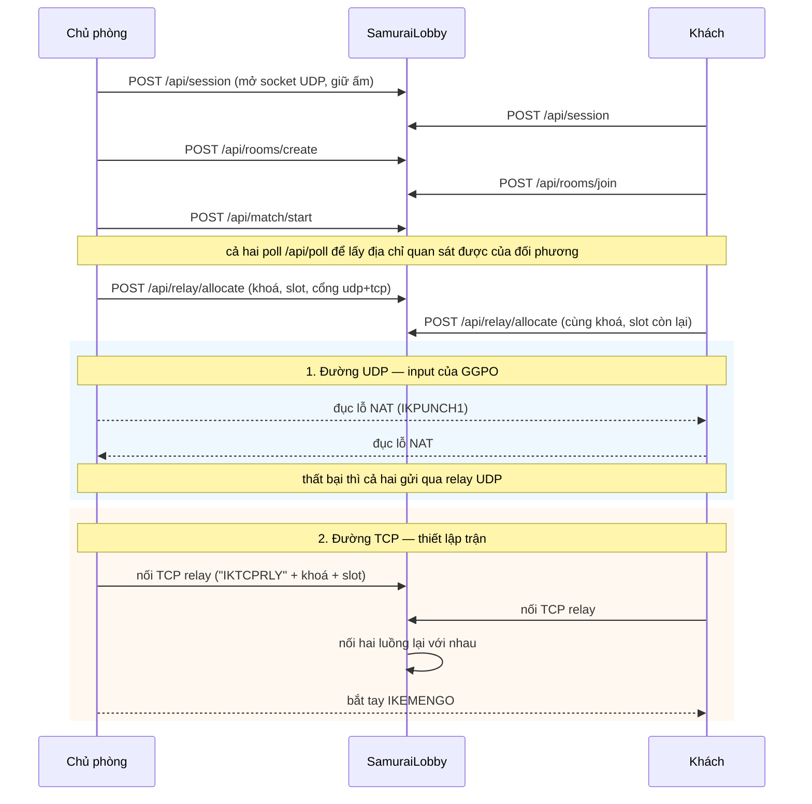

# Samurai Shodown II — Online

*[English](ARCHITECTURE.md) · Tiếng Việt*

Chơi Samurai Shodown II qua internet với rollback netcode, ghép trận tự động và
đục lỗ NAT — không bên nào phải mở cổng trên router.

Kế hoạch ban đầu là viết lại game bằng Unity; hướng đó và những gì cần làm để
quay lại nó được mô tả ở [`README.vi.md`](README.vi.md#b-viết-lại-bằng-unity--kế-hoạch-ban-đầu-vẫn-khả-thi).
Nó bị gác lại vì làm lại vật lý, hộp va chạm và frame data của một game đối
kháng năm 1994 từ con số không là công việc nhiều năm, còn rollback netcode thì
gắn thêm vào khó hơn nhiều so với thừa hưởng sẵn. Fork một engine tương thích
MUGEN đã tích hợp GGPO sẽ tới được bản chơi online nhanh hơn hẳn.

---

## 1. Bố cục

Đây là kho **nhiều module**, không phải monorepo build chung. Mỗi module Go độc
lập và đánh phiên bản riêng.

Gốc của kho git là `SamuraiOnline/`. Mọi thứ thuộc sở hữu SNK nằm **cao hơn một
cấp**, tức nằm ngoài kho theo cấu trúc, chứ không chỉ nhờ `.gitignore`:

```
Samurai/                      thư mục làm việc, không theo dõi bởi git
├── Game/                     dữ liệu game gốc
├── Decompiled code/          kết quả Ghidra dịch ngược SAMURAI2.EXE
├── Samurai.rep/              project Ghidra
├── Screenpack/               art MUGEN của bên thứ ba
├── SamuraiAssets/            sprite do sprtool trích xuất
├── SamuraiShodown-XMatStudio/  đồ án sinh viên, nguồn cho chargen
└── SamuraiOnline/            <- gốc kho git
```

| Đường dẫn | Module | Là gì |
|---|---|---|
| `Ikemen-GO/` | `github.com/ikemen-engine/Ikemen-GO` | Fork của engine. Chạy game. |
| `ggpo/` | `github.com/ikemen-engine/ggpo` | Fork của thư viện rollback. |
| `SamuraiLobby/` | `samurai/lobby` | Máy chủ ghép trận + xuyên NAT. |
| `SamuraiTools/chargen/` | `samurai/chargen` | Dựng nhân vật Ikemen từ bảng animation C++. |
| `SamuraiTools/sprtool/` | `samurai/sprtool` | Dịch ngược và trích xuất sprite của game gốc. |
| `deploy/` | — | systemd unit và file cấu hình để chạy lobby như một dịch vụ. |
| `unity-prototype/` | — | Bản Unity làm dở. Giữ lại để tham khảo. |

Cả hai fork đều được **nhúng thẳng** (vendored), không phải submodule: bản
checkout gốc của chúng ở trạng thái detached head và còn thay đổi chưa commit,
nên file được commit trực tiếp vào đây. Commit gốc, để sau này rebase:

| Fork | Nguồn | Commit |
|---|---|---|
| `ggpo/` | `github.com/ikemen-engine/ggpo` | `b08e7d27b7f20d7bb5bf5e20beb655060e82769a` |
| `Ikemen-GO/` | `github.com/ikemen-engine/Ikemen-GO` | nhánh `develop` |

### Vì sao phải fork hai thư viện

Phải fork `ggpo` vì `transport.Connection` tham chiếu tới
`ggpo/internal/messages`, mà Go cấm import package `internal` của module khác.
Cài đặt interface đó từ bên ngoài là bất khả thi — điều này đã được **kiểm
chứng bằng thực nghiệm**, không phải phỏng đoán. Bản fork mang hai thay đổi:

```go
// ggpo/transport/udp.go
func NewUdpWithConn(h MessageHandler, conn net.PacketConn, localPort int) Udp
```

Nó cho phép game trao cho GGPO một socket đã đi qua bước xuyên NAT, thay vì để
GGPO tự mở socket riêng.

```go
// ggpo/internal/polling/poll.go
const MaxLoopSinks = 4 + 32 + 1
```

Bộ đệm loop-sink vốn chỉ có 16 chỗ trong khi `MaxSpectators` khai là 32, nên máy
chủ **panic ngay khi người xem thứ 15 vào**. Một test phát hiện ra; hằng số giờ
đủ chỗ cho mọi endpoint có thể đăng ký vòng lặp.

`Ikemen-GO/go.mod` nối chúng lại:

```
replace github.com/ikemen-engine/ggpo => ../ggpo
```

---

## 2. Một trận đấu được thiết lập ra sao



Hai đường độc lập, vì yêu cầu của chúng khác nhau:

- **UDP** chở input của GGPO. Cực kỳ nhạy với độ trễ, nên luôn ưu tiên đường
  trực tiếp, relay chỉ là phương án cuối.
- **TCP** chở phần thiết lập trận (và nếu tắt rollback thì chở **toàn bộ**
  input). Đường trực tiếp đòi hỏi chủ phòng nhận được kết nối vào, mà đó đúng là
  thứ người ngồi sau NAT không làm được — nên đường qua lobby sẽ thử trực tiếp
  trước rồi mới lùi về relay.

### Ràng buộc phải dùng lại đúng socket

NAT ánh xạ **từng cổng nguồn** riêng biệt. Thăm dò bằng một socket tạm sẽ cho ra
một ánh xạ mà game không bao giờ dùng tới. Vì vậy socket UDP được mở ngay khi
người chơi vào lobby, giữ ấm bằng các gói dò địa chỉ định kỳ, và chỉ được trao
cho GGPO sau khi đã chọn xong đường đi. Đó là lý do `NewUdpWithConn` tồn tại.

---

## 3. Giao thức đường truyền

### Relay UDP (`SamuraiLobby/relay.go`)

| Byte 0 | Nội dung | Chiều |
|---|---|---|
| `0x01` | đệm, tối thiểu 64 byte | client → server, hỏi địa chỉ |
| `0x81` | `[len][ip][port BE16]` | server → client, địa chỉ quan sát được |
| `0x02` | `[khoá 16 byte][slot][dữ liệu]` | client → server, dữ liệu relay |
| — | chỉ `dữ liệu` | server → đối phương, đã bóc header |

Mức tối thiểu 64 byte cho gói hỏi địa chỉ ngăn máy chủ bị lợi dụng làm **bộ
khuếch đại lưu lượng** cho nguồn giả mạo: gói trả lời không bao giờ được lớn hơn
gói hỏi.

Vì relay bóc header trước khi chuyển tiếp, đối phương nhận được payload nguyên
vẹn và GGPO có thể coi địa chỉ relay như thể chính là đối thủ.

### Relay TCP (`SamuraiLobby/tcprelay.go`)

Header cố định 25 byte, sau đó luồng được nối nguyên văn:

```
"IKTCPRLY" [khoá 16 byte] [slot]
```

Khoá chính là khoá đã cấp bởi `/api/relay/allocate`, nên không sinh thêm thông
tin xác thực mới. Khoá lạ bị từ chối — nếu không, hai người lạ chỉ cần thống
nhất một khoá ngẫu nhiên là biến máy chủ thành proxy miễn phí.

### HTTP API (`SamuraiLobby/api.go`)

```
POST /api/session          -> id, token, udpToken, relayHost, relayPort
GET  /api/rooms            -> rooms[]
POST /api/rooms/create     -> room
POST /api/rooms/join       {roomId, spectator}
POST /api/rooms/leave
POST /api/match/start
POST /api/match/manifest   {manifest}  (chỉ chủ phòng)
POST /api/poll             -> self, room, match
POST /api/relay/allocate   -> host, port, tcpPort, key, slot
GET  /healthz
```

Người xem ngồi ở ghế tách biệt với hai ghế người chơi, nên phòng vẫn còn chỗ
trong lúc có người theo dõi. Chỉ chủ phòng được biết người xem ở đâu, vì chỉ chủ
phòng phát khung hình cho họ; và cũng chỉ chủ phòng được công bố manifest cho
biết cần nạp trận đấu nào. Relay chỉ có hai slot nên người xem bị từ chối cấp:
họ đi theo đường UDP đã đục lỗ, hoặc không xem được.

Những quyết định bảo mật đáng giữ:

- IP của client **luôn** lấy từ `RemoteAddr`, không bao giờ lấy từ thân yêu cầu.
  `X-Forwarded-For` chỉ được tin khi bật `-trust-proxy`.
- `udpToken` tách riêng khỏi bearer token của HTTP, nên token đi trên UDP không
  mã hoá không thể dùng lại để tấn công HTTP API.
- Token sinh từ `crypto/rand`.
- Phiên relay bị chặn trần: 64 MiB, nghỉ 60 giây, sống tối đa 2 giờ.

---

## 4. Fork engine — file thêm mới hoặc sửa đổi

| File | Trạng thái | Mục đích |
|---|---|---|
| `src/lobby.go` | mới | Client của lobby. Mọi HTTP chạy ngoài vòng lặp game. |
| `src/netpath/transport.go` | mới | Phiên NAT, đục lỗ, `relayConn` UDP, `DialRelayStream`. Tách package riêng để build được không cần cgo. |
| `src/netpath/handshake.go` | mới | Token hai bên trao đổi trước khi tin luồng thiết lập trận. |
| `src/nettransport.go` | mới | Ánh xạ `netpath` vào `package main` để nơi gọi trong engine không phải sửa. |
| `cmd/netcheck/main.go` | mới | Công cụ độc lập, không cgo, kiểm tra đường mạng giữa hai máy. |
| `src/netplay.go` | sửa | `conn` giờ là `net.Conn`; thêm `AcceptRelayed`/`ConnectRelayed` và cặp ưu tiên trực tiếp `AcceptDirectThenRelay`/`ConnectDirectThenRelay`. |
| `src/rollback.go` | sửa | `InitP1`/`InitP2` gọi `natRemote` và `initGGPOConnection`; thêm `InitSpectator` và `attachSpectators`. |
| `src/script.go` | sửa | `enterNetPlay` dùng chung `netPlayBegin()`. |
| `src/config.go` | sửa | `Netplay.LobbyURL`, `Netplay.LobbyName`. |
| `src/system.go` | sửa | gọi `lobbyScriptInit(l)`. |
| `external/script/lobby.lua` | mới | Màn hình duyệt phòng, lối vào chế độ xem, công bố manifest. |
| `external/script/main.lua` | sửa | Xử lý `lobbybrowser`; `f_connect` nhận thêm vai trò relay. |
| `data/ikemen1/system.def` | sửa | Mục menu `ONLINE LOBBY`. |
| `data/select.def` | sửa | Bỏ các nhân vật mẫu của Ikemen khỏi danh sách. |

### Hàm Lua (`src/lobby.go`)

```
lobbyConnect  lobbyDisconnect  lobbyStatus   lobbyRooms
lobbyCreateRoom  lobbyJoinRoom  lobbyLeaveRoom
lobbyMatch    lobbyMarkPlaying  lobbyEstablishPath
lobbyNatMode  lobbyLocalAddr    lobbyRelayStream  lobbyEnterNetPlay
lobbySpectateRoom  lobbyPublishManifest  lobbyManifest  lobbyEnterSpectate
```

---

## 5. Dây chuyền chuyển đổi asset

### `sprtool` — sprite của game gốc

Định dạng `.SPR` được dịch ngược từ đoạn mã vẽ đã decompile, **không phải đoán**.
Đặc tả đầy đủ nằm ở `/memories/repo/samsho2-formats.md`.

```
Container (magic 0x1053):
  0x00 u16 magic   0x02 u16 count   0x04 u32 dataSize   0x08 n*12 records
Record (12 byte):
  u16 type(0=sprite,1=rỗng)  u16 bank màu  u16 w  u16 h  u32 offset
Pixel (từ FUN_004dc8e0):
  mỗi hàng: [u16 độ dài hàng tính cả tiền tố][các byte điều khiển]
  b & 0x80  -> chuỗi (b & 0x7F) chỉ số màu ghi thẳng
  ngược lại -> bỏ qua b pixel trong suốt
Bảng màu:
  4bpp; bank là chỉ số vào bảng RGB555 4096 mục
  bảng nằm ở GAME1.PRG + 0x14000 (6 ảnh chụp, mỗi ảnh 4096 mục)
```

Kết quả: 12.472 sprite từ 17 file nhân vật, 0 lỗi.

### `chargen` — nhân vật chơi được

Chuyển bảng animation C++ của X-Mat Studio thành một nhân vật Ikemen
(`.def`, `.sff`, `.air`, `.cns`, `.cmd`).

Hai điều rất dễ làm sai, đã được test ghim chặt:

- File `.def` **bắt buộc** phải khai `st = <base>.cns`. Hàm `Compile()` của
  Ikemen chỉ đọc `cmd`, `stcommon` và các khoá khớp `^st[0-9]*$` — **không bao
  giờ** đọc `cns`. Thiếu dòng đó thì mọi state bị bỏ qua trong im lặng và nhân
  vật không có chiêu nào.
- Nhân vật **không được** định nghĩa các state 0/10/11/12/20/40/50/52. Ikemen đã
  có sẵn bản đúng trong `data/common1.cns.zss`, và engine tự điều khiển chuyển
  tiếp giữa chúng (`char.go`, phần "Perform basic actions") — nhưng chỉ khi
  `ctrl` được bật. Định nghĩa đè lên làm hỏng đi lại và đứng dậy.

Các state dùng chung đó còn gọi animation theo **số cố định**, và nhân vật thiếu
một số nào đó sẽ rơi vào state không có hình — nếu state ấy lại chờ `animTime`
thì nó không bao giờ thoát ra. Lỗi này đã cắn hai lần, lần đầu khi đi lại, lần
sau khi đỡ đòn, và **cả hai lần đều phát hiện nhờ chơi thử chứ không phải nhờ
test**. `commonanims_test.go` giờ đọc thẳng các số đó ra từ `common1.cns.zss`
thay vì chép lại, nên một tham chiếu mới sẽ làm hỏng bản build chứ không làm
hỏng trận đấu. `chargen` lấp chỗ trống bằng cách trỏ số thiếu sang khung hình có
sẵn gần nhất; những chuyển tiếp mà engine phải chờ đều được gán thời lượng hữu
hạn rõ ràng.

---

## 6. Điều khiển

Bố cục bốn nút của Neo Geo, giống bản arcade gốc.

| Chức năng | Neo Geo | P1 | P2 |
|---|---|---|---|
| Di chuyển | — | W A S D | phím mũi tên |
| Chém nhanh | A | J | KP_1 |
| Chém mạnh | B | K | KP_2 |
| Chém cực mạnh | A+B | L | KP_3 |
| Đá nhanh | C | U | KP_4 |
| Đá mạnh | D | I | KP_5 |
| Đá cực mạnh | C+D | O | KP_6 |
| Nhặt kiếm | — | P | KP_7 |
| Start | — | Space | KP_0 |

Các nút ánh xạ sang `x y z a b c` theo thứ tự MUGEN — đấm ở `x y z`, đá ở
`a b c`. Đảo ngược cặp này là lỗi rất dễ mắc; `keyconfig_test.go` canh chừng nó.
Lưu ý `StringToKeyLUT` chỉ được nạp bởi `initLUTs()`, nên test nào đụng tới tên
phím phải gọi hàm đó trước.

---

## 7. Build và chạy

Build thì cần Linux; trên Windows hoặc dùng bản phát hành sẵn, hoặc build trong
WSL / MSYS2. Đường dẫn tính từ gốc kho. `$GAME` là nơi bạn để bản game của
riêng mình, `$XMAT` là bản checkout của X-Mat Studio — cả hai đều không thuộc
kho này.

```bash
# Engine. Các cờ này là bắt buộc.
cd Ikemen-GO
GOFLAGS=-mod=mod GOEXPERIMENT=arenas CGO_ENABLED=1 go build -o Ikemen_GO_Linux ./src

# Chạy dưới WSLg
DISPLAY=:0 WAYLAND_DISPLAY=wayland-0 XDG_RUNTIME_DIR=/mnt/wslg/runtime-dir \
  ./Ikemen_GO_Linux -p1 jubei -p2 jubei2 -s kfm

# Máy chủ lobby
cd SamuraiLobby
go run . -addr :8080 -relay-addr :8081 -relay-tcp-addr :8081 -relay-host <ip-public>

# Sinh lại nhân vật
cd SamuraiTools/chargen
go run . -src "$XMAT/ModulePlayer.cpp"  -sheet "$XMAT/Game/Assets/Sprites/jubei.png" \
  -out ../../Ikemen-GO/chars/jubei  -name Jubei      -base jubei
```

Thư viện cần để build: `golang-go git pkg-config make nasm yasm build-essential
libxmp-dev libsdl2-dev libgtk-3-dev libavformat-dev libavcodec-dev libavutil-dev
libswresample-dev libswscale-dev libavfilter-dev`

### Chạy test

```bash
(cd SamuraiLobby         && go test ./...)
(cd SamuraiTools/sprtool && go build ./...)
(cd SamuraiTools/chargen && CHARGEN_SOURCE="$XMAT/ModulePlayer.cpp" go test ./...)
(cd Ikemen-GO && GOFLAGS=-mod=mod GOEXPERIMENT=arenas CGO_ENABLED=1 \
  go test ./src/... -count=1 -vet=off)
```

### Kiểm tra đường mạng giữa hai máy

Engine liên kết tới SDL, FFmpeg và GTK, nên file test của nó cần khoảng 200 thư
viện chia sẻ và không thể chép sang máy khác. `cmd/netcheck` chỉ import
`src/netpath` — đó chính là lý do package ấy tồn tại: nó thuần Go, nên công cụ
này biên dịch chéo ra **một file duy nhất chạy được ở mọi nơi**.

```bash
cd Ikemen-GO
CGO_ENABLED=0 go build -o netcheck ./cmd/netcheck
CGO_ENABLED=0 GOOS=windows GOARCH=amd64 go build -o netcheck.exe ./cmd/netcheck
```

Chạy trên cả hai máy, cùng một lobby và cùng tên phòng:

```bash
./netcheck -lobby http://<may-chu-lobby>:8080 -role host  -room check
./netcheck -lobby http://<may-chu-lobby>:8080 -role guest -room check
```

Nó báo `PUNCHED` hoặc `RELAYED`, và xác nhận luồng thiết lập trận chuyển được
dữ liệu nguyên vẹn. Vì nó chạy đúng đoạn mã mà engine dùng, nên hỏng ở đây là
hỏng thật.

Ngoài ra còn một bài kiểm tra trực tiếp điều khiển chính `LobbyClient` của
engine, mặc định bỏ qua nếu không chỉ định máy chủ:

```bash
SAMURAI_LIVE_LOBBY=http://<may-chu-lobby>:8080 SAMURAI_LIVE_ROLE=host \
  go test ./src -run TestLiveLobby -v -count=1 -vet=off
```

---

## 8. Tình trạng

### Đang chạy được

- Máy chủ lobby: phiên, phòng, ghép trận, poll — 25 test
- Đục lỗ NAT UDP kèm phương án lùi về relay. Đã kiểm chứng giữa hai máy có một
  lớp NAT ở giữa: xuyên được trong khoảng 200–350 ms, luồng thiết lập nguyên vẹn
- Relay TCP cho phần thiết lập trận, ưu tiên trực tiếp rồi mới lùi về relay
- Engine build và chạy được; vào được màn duyệt phòng từ menu chính
- `chargen`: Jubei + Jubei 2P, hơn 100 animation, 18 đòn đánh, 3 chiêu đặc biệt
- `sprtool`: giải mã trọn vẹn `.SPR`, trích được 12.472 sprite đúng màu
- Cơ chế SamSho: thanh POW khi trúng đòn, nộ khi POW ≥ 2500, rơi và nhặt kiếm
- Chế độ xem trận, qua `ggpo.NewSpectator`
- CI chạy mỗi lần push (`ci.yml`), build Linux và Windows khi gắn tag (`release.yml`)
- `cmd/netcheck`: chạy đúng phần NAT và relay thật dưới dạng file độc lập không
  cgo, nên kiểm tra được đường mạng từ bất kỳ máy nào

### Chưa chạy được / chưa làm

| Thiếu sót | Ghi chú |
|---|---|
| **Chưa từng thử qua internet** | Đục lỗ NAT chạy được giữa hai máy qua một lớp NAT, nhưng mọi phép thử đến giờ đều trong cùng một mạng LAN. NAT đối xứng hoặc CGNAT — thứ mà phần lớn đường truyền gia đình hiện nay cấp — là bài toán khó hơn nhiều và vẫn chưa được chứng minh. |
| **Bản thân game chưa từng được chơi qua mạng** | `netcheck` chứng minh đường mạng mở được. Nó không nói gì về việc đồng bộ màn chọn nhân vật, hành vi rollback hay lệch trạng thái. |
| **Chỉ có đúng một nhân vật thật** | Jubei, lấy từ Samurai Shodown **1**. Chưa phải dàn nhân vật của bản II. |
| **Sprite trích ra chưa dùng làm nhân vật được** | Bản ghi `.SPR` không có điểm neo, không nhóm animation, không thời lượng khung, không hộp va chạm. Dựng nhân vật từ chúng đồng nghĩa phải dịch ngược cả hệ thống animation. |
| **Bảng màu nằm ở RAM lúc chạy** | Bảng con trỏ tại VA `0x77EC00` rỗng trong file EXE và chỉ được điền lúc chạy, nên chỉ biết được màu của Haohmaru một cách tĩnh. Cần dump RAM bảng màu lúc game đang chạy. |
| **Chưa cân chỉnh gameplay** | Vận tốc vẫn là giá trị mặc định của KFM. Tỉ lệ, thời điểm và thuộc tính đòn đánh chưa đối chiếu với bản gốc. |
| **Người xem không kiểm tra nội dung** | Người chơi có đối chiếu vân tay nội dung trước trận; người xem thì không. Ai có `select.def` khác chủ phòng sẽ nạp nhầm nhân vật, vì manifest chỉ mang chỉ số trong danh sách. |

---

## 9. Pháp lý

SNK sở hữu Samurai Shodown II và vẫn đang bán nó. Kho này **chỉ được phép** chứa
engine và công cụ. Dữ liệu game, sprite trích xuất, âm thanh trích xuất và file
nhị phân đã dịch ngược **tuyệt đối không được** commit hay phân phối — đúng mô
hình ScummVM / OpenRA: phần mềm thì tự do, còn asset là của chính người dùng.

`.gitignore` cưỡng chế điều này với file mới. Thứ gì đã lỡ nằm trong lịch sử git
thì phải gỡ riêng.
